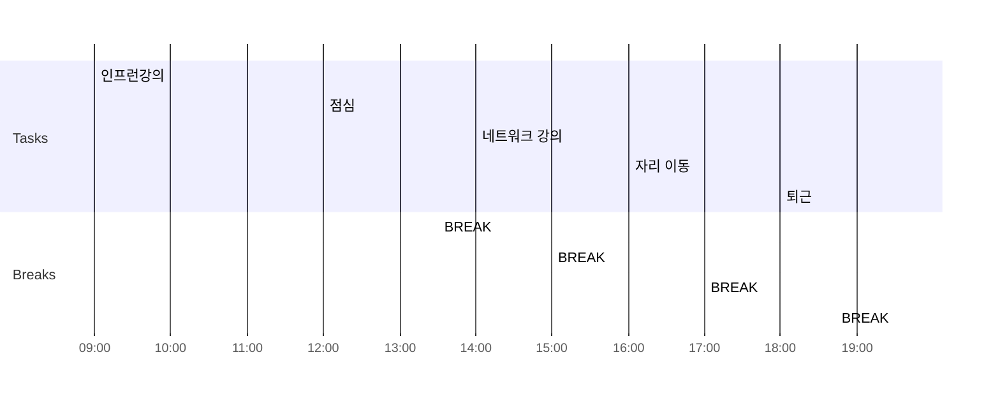

# 08.11
주간 내역
[[2022-W33]]

- [x] 09:00 인프런강의
- [x] 12:00 점심
- [x] 13:30 BREAK
- [x] 14:00 네트워크 강의
- [x] 15:00 BREAK
- [x] 16:00 자리 이동
- [x] 17:00 BREAK
- [x] 18:00 퇴근
- [x] 19:30 BREAK
- [x] 21:00 깃헙 블로그 다시만들기

### Day Planner

